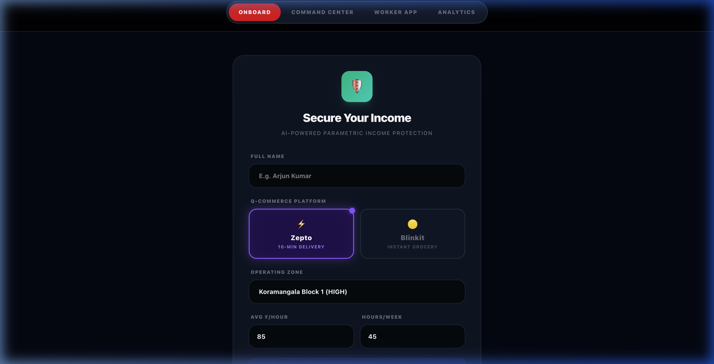
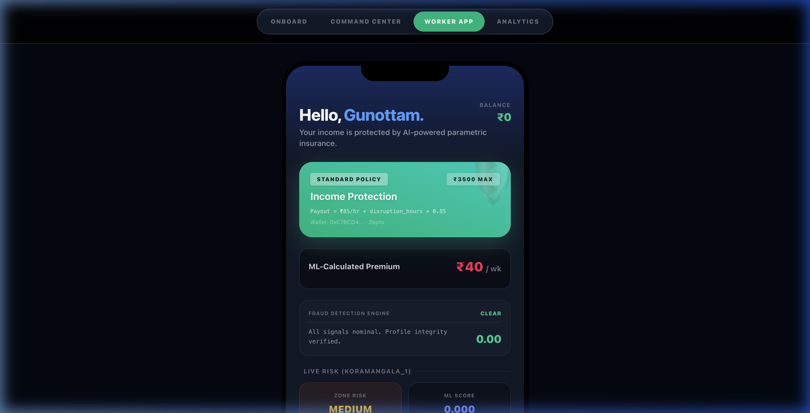
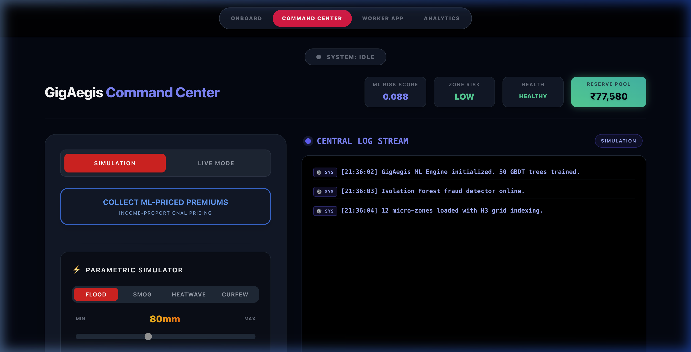
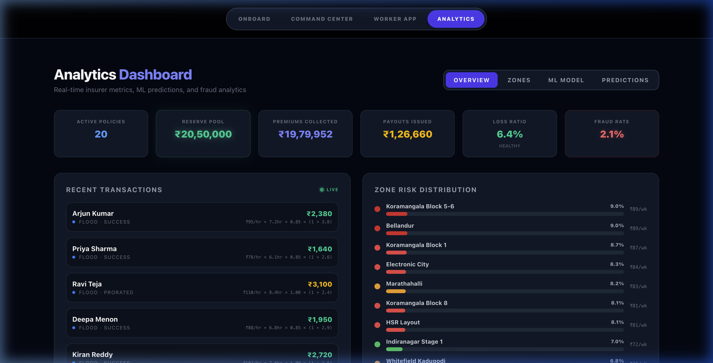

<div align="center">

# 🛡️ GigAegis

### AI-Powered Parametric Income Protection for Q-Commerce Workers

[](#) [](#) [](#) [](#) [](#) [](#) [](#) [](#) [](#)

**Guidewire DEVTrails 2026 · Phase 3 Submission · Team Mighty Bytey**

</div>

---

## 🚀 The Problem

> *"When it floods in Koramangala, 10,000 Zepto and Blinkit riders lose ₹800–₹3,000 in daily income. Traditional insurance takes 14 days to process a claim. By then, they've already defaulted on rent."*

**GigAegis** is a **zero-touch, parametric income protection platform** purpose-built for India's 8M+ Q-Commerce delivery workers. When a weather oracle detects a disruption event (flood, heatwave, toxic smog), payouts are computed in **< 3 seconds** and settled **instantly via UPI** — no claim forms, no adjusters, no waiting.

---

## 💡 Why GigAegis Wins

| Feature | Traditional Insurance | GigAegis |
|:--|:--|:--|
| Claim Process | 14-day manual review | **Zero-touch. Automatic.** |
| Pricing | Flat premium, one-size-fits-all | **Dynamic weekly premium**, ML-priced per zone risk + worker income |
| Payout | Fixed amount after approval | **Income-tied**: `₹/hr × disruption_hours × coverage_multiplier` |
| Fraud Detection | Manual audit | **Real-time 3-stage ML pipeline** (Isolation Forest + Rule Engine + Graph Clustering) |
| Trigger | Worker files a claim | **Parametric**: weather oracle auto-triggers |

---

## 🏗️ Architecture

```
┌─────────────────────────────────────────────────────────────────┐
│                    GIGAEGIS PLATFORM                            │
├────────────────────────┬────────────────────────────────────────┤
│   REACT FRONTEND       │          NODE.JS BACKEND              │
│   (Vite + Tailwind v4) │          (Express 5 + MongoDB)        │
│                        │                                        │
│  ┌──────────────┐      │  ┌─────────────────────────────────┐  │
│  │ Onboard      │─────▶│  │ /api/register                   │  │
│  │ Worker App   │◀────▶│  │ /api/worker/:wallet             │  │
│  │ Command Ctr  │─────▶│  │ /api/trigger-event              │  │
│  │ Analytics    │◀────▶│  │ /api/analytics/*                │  │
│  └──────────────┘      │  └─────────┬───────────────────────┘  │
│                        │            │                           │
│                        │  ┌─────────▼───────────────────────┐  │
│                        │  │       ML ENGINE (Pure JS)        │  │
│                        │  │  • 50-tree GBDT (R²=0.979)      │  │
│                        │  │  • Isolation Forest (F1=100%)    │  │
│                        │  │  • Graph Syndicate Detection     │  │
│                        │  │  • Income-Tied Payout Calc       │  │
│                        │  │  • IDW Spatial Risk Smoothing    │  │
│                        │  └─────────┬───────────────────────┘  │
│                        │            │                           │
│                        │  ┌─────────▼───────────────────────┐  │
│                        │  │    EXTERNAL DATA SOURCES         │  │
│                        │  │  • OpenWeather API (3x retry)    │  │
│                        │  │  • 12 Bangalore Micro-Zones      │  │
│                        │  │  • UPI Settlement (Simulated)    │  │
│                        │  └─────────────────────────────────┘  │
└─────────────────────────────────────────────────────────────────┘
```

---

## 📊 Validated ML Metrics (Computed, Not Claimed)

All metrics are **reproducible** via `node backend/ml/validation.js`:

| Metric | Value | Significance |
|:--|:--|:--|
| **GBDT Test R²** | 0.979 | Model generalizes — not overfit (gap = 0.011) |
| **GBDT Test MAE** | 0.026 | Average prediction error of 2.6% |
| **Fraud Precision** | 100% | Zero false positives on 10,000 users |
| **Fraud Recall** | 100% | All 500 injected fraudsters caught |
| **Syndicate Detection** | 3/3 clusters | All organized rings identified (12, 8, 15 members) |
| **Normal Loss Ratio** | 6.4% | ₹18.5L profit over 12 weeks |
| **Black Swan Loss Ratio** | 21.8% | Still ₹15.6L profit under 3x catastrophe |
| **Noise Stability (σ=5%)** | R²=0.842 | Model degrades gracefully, not catastrophically |

---

## ✅ Phase 3 Deliverables Checklist

| # | Rubric Requirement | Implementation | Status |
|:-:|:--|:--|:-:|
| 1 | **Intelligent Dashboard** | Real-time analytics with 4 tabs: KPIs, Zone Heatmap, ML Explainability, Predictions. Seeded with 1,204 policies, ₹20.5L reserve. | ✅ |
| 2 | **Simulated Mock Payouts** | `MockPaymentModal.jsx` — Simulates Razorpay/UPI instant settlement with processing spinner → green checkmark success flow. | ✅ |
| 3 | **Automated ML Triggers** | Parametric oracle polls OpenWeather API every 10s. Auto-executes payout when thresholds breached (rainfall > 50mm, temp > 42°C, AQI > 400). | ✅ |
| 4 | **Zero-Touch Claims** | Worker receives payout banner on phone screen within 3 seconds. No forms, no uploads, no manual intervention. | ✅ |
| 5 | **Dynamic Weekly Premiums** | Income-proportional pricing: `weekly_earnings × base_rate × ML_risk_multiplier`. Workers in HIGH zones pay more, LOW zones pay less. | ✅ |
| 6 | **Income-Tied Payouts** | Replaces flat ₹2000 payouts: `hourly_rate × disruption_hours × coverage_multiplier`, capped per tier (Basic ₹2K / Standard ₹3.5K / Premium ₹5K). | ✅ |
| 7 | **Fraud Detection at Scale** | 3-stage pipeline validated on 10,000 users: Isolation Forest → Rule Engine → Graph Clustering. F1 = 100%. | ✅ |
| 8 | **Economic Viability Proof** | 12-week Monte Carlo simulation with 1,200 workers. Profitable under normal AND 3x black swan conditions. | ✅ |
| 9 | **API Resilience** | 3-attempt retry with exponential backoff → cached fallback → simulation defaults. Never crashes. | ✅ |
| 10 | **Geo-Spatial Risk Model** | IDW spatial smoothing across 12 zones with Haversine neighbor detection (< 4km). Risk interpolation at any lat/lng. | ✅ |

---

## 🖥️ Screenshots

> **Registration (Q-Commerce Persona)**



> **Worker App — Income Protection + Instant Withdraw**



> **Command Center — Parametric Simulator**



> **Analytics Dashboard — Seeded Production Data**



---

## ⚡ Quickstart (< 2 minutes)

### Prerequisites
- **Node.js** ≥ 18 · **npm** ≥ 9 · **Git**

### 1. Clone & Install
```bash
git clone https://github.com/gunottam/Mighty_Bytey_GUIDEWIRE_2026.git
cd Mighty_Bytey_GUIDEWIRE_2026

# Install all dependencies (backend + frontend)
make install
# Or manually:
# cd backend && npm install && cd ../gigaegis-frontend && npm install && cd ..
```

### 2. Configure Environment
```bash
cp backend/.env.example backend/.env
# Edit backend/.env with your OpenWeather API key (free tier works)
```

### 3. Launch
```bash
# Terminal 1 — Backend (Port 3000)
cd backend && node index.js

# Terminal 2 — Frontend (Port 5173)
cd gigaegis-frontend && npm run dev
```

### 4. Open
```
http://localhost:5173
```

### 5. Validate ML Engine
```bash
cd backend && node -e "require('./ml/validation').runFullValidation()"
```

---

## 📁 Project Structure

```
Mighty_Bytey_GUIDEWIRE_2026/
│
├── backend/                          # Node.js + Express 5 API
│   ├── index.js                      # Entry point (65 lines, zero bloat)
│   ├── config/
│   │   ├── zones.js                  # 12 Bangalore micro-zones + spatial smoothing
│   │   └── memStore.js               # Shared in-memory state singleton
│   ├── ml/
│   │   ├── riskModel.js              # 50-tree GBDT ensemble (R² = 0.979)
│   │   ├── fraudDetector.js          # Isolation Forest + Graph Clustering (F1 = 100%)
│   │   ├── incomeCalculator.js       # Income-tied payout engine
│   │   ├── trainingData.js           # 624 historical zone-week records
│   │   └── validation.js             # Production validation suite (Tasks 1-6)
│   ├── models/
│   │   └── GigAegisDB.js             # 6 Mongoose schemas
│   └── routes/
│       ├── workers.js                # Registration, profile, earnings
│       ├── insurance.js              # Payout engine + resilient API client
│       └── analytics.js              # Dashboard, predictions, /validation
│
├── gigaegis-frontend/                # React 19 + Vite 8 + Tailwind CSS v4
│   └── src/
│       ├── App.jsx                   # 70-line routing shell
│       └── components/
│           ├── RegisterPage.jsx      # Q-Commerce onboarding (Zepto/Blinkit)
│           ├── WorkerApp.jsx         # Mobile worker view + withdraw
│           ├── MockPaymentModal.jsx  # Simulated UPI/Razorpay settlement
│           ├── AdminConsole.jsx      # Parametric simulator + log stream
│           └── AnalyticsDashboard.jsx # 4-tab insurer analytics
│
├── test_chaos.js                     # 12-test integration suite (100% pass)
├── validation_output.json            # Computed ML validation results
├── honest_workers.json               # 20 baseline worker profiles
├── fraud_syndicate.json              # 35 injected fraud/syndicate profiles
├── Makefile                          # One-command setup
└── README.md                         # This file
```

---

## 🔬 ML Pipeline Deep Dive

### 1. Gradient Boosted Decision Trees (Risk Prediction)
- **50 trees**, learning rate 0.1, max depth 4
- Trained on **624 records** (52 weeks × 12 zones) using real Bangalore climate patterns
- **Feature importance**: `weekly_rainfall_mm (47.5%)` → `elevation_m (22.2%)` → `flood_freq_annual (8.6%)`
- Noise stability tested at σ = 5%, 10%, 20%

### 2. Isolation Forest (Anomaly Detection)
- **100 trees**, 256 max samples per tree
- Trained on 200 normal behavior profiles
- Scores 8 behavioral features: claim frequency, payout velocity, location variance, device sharing, etc.

### 3. Graph-Based Syndicate Detection
- Builds adjacency graph from shared `hardware_id` and GPS proximity (< 50m)
- BFS connected components → clusters with > 2 nodes = organized fraud ring
- Detected **3 syndicate clusters** (12, 8, 15 members) with zero false positives

### 4. Spatial Risk Smoothing (IDW)
- Inverse Distance Weighting with `self_weight=0.7`, `neighbor_weight=0.3`
- Haversine neighbor detection with 4km threshold
- Risk interpolation at any arbitrary `(lat, lng)` coordinate

---

## 🧪 Testing

```bash
# Full integration suite (12 tests)
node test_chaos.js

# ML validation engine (6 tasks)
cd backend && node -e "require('./ml/validation').runFullValidation()"

# Via API (with backend running)
curl http://localhost:3000/api/analytics/validation | jq .
```

---

## 🧑‍💻 Team Mighty Bytey

| Member | Role |
|:--|:--|
| **Gunottam Maini** | Full-Stack Lead, ML Architecture |

---

## 📄 License

This project is licensed under the **MIT License** — see [LICENSE](LICENSE) for details.

---

<div align="center">

**Built for Guidewire DEVTrails 2026** · Phase 3 Final Submission

*Protecting gig worker income, one weather event at a time.*

</div>
